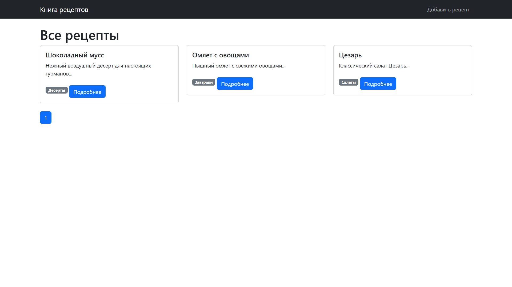
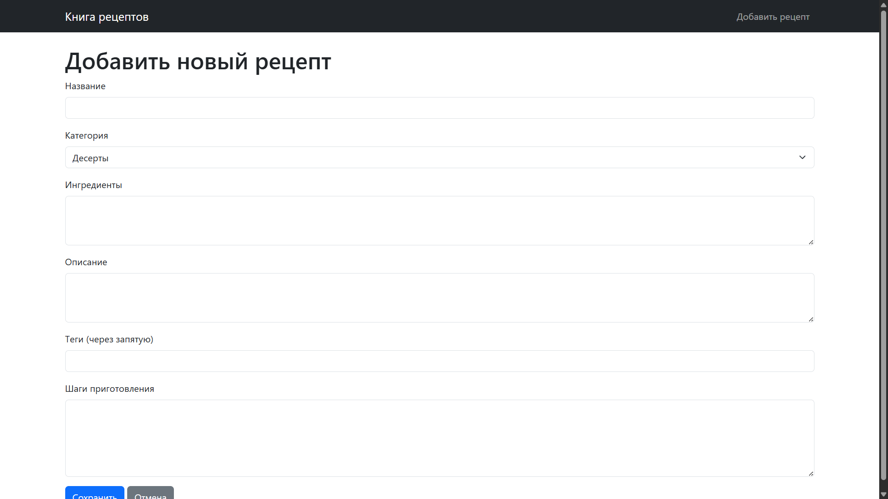
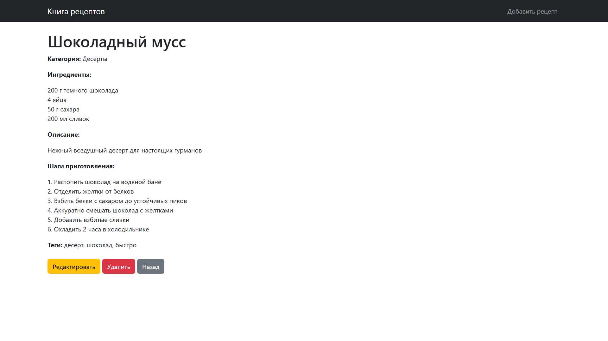
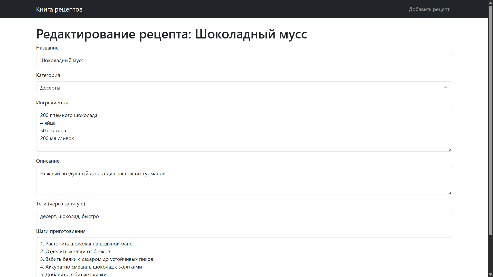

# Recipe Book - Книга рецептов

 

## Оглавление
1. [Особенности](#особенности)
2. [Установка](#установка)
3. [Использование](#использование)
4. [Скриншоты](#скриншоты)
5. [Контрольные вопросы](#контрольные-вопросы)

## Особенности

- 📝 Полный CRUD для рецептов (создание, чтение, обновление, удаление)
- 🗃️ Система категорий
- 🔍 Поиск по тегам и названиям
- 📱 Адаптивный дизайн
- 🛡️ Защита от SQL-инъекций
## Установка

### Требования
- Веб-сервер (Apache/Nginx)
- PHP 8.4+
- MySQL 8.0+

### Настройка БД
```sql
CREATE DATABASE recipe_book;
USE recipe_book;

-- Создание таблиц (см. полный SQL в migration.sql)
```

### Конфигурация
Отредактируйте `config/db.php`:
```php
return [
    'host' => 'localhost',
    'dbname' => 'recipe_book',
    'username' => 'root',
    'password' => '',
    'charset' => 'utf8mb4'
];
```

## Использование

| Действие         | URL                                        |
| ---------------- | ------------------------------------------ |
| Главная          | `/public/index.php`                        |
| Просмотр рецепта | `/public/index.php?route=recipe/show&id=1` |
| Добавление       | `/public/index.php?route=recipe/create`    |
| Редактирование   | `/public/index.php?route=recipe/edit&id=1` |

## Скриншоты

1. 
2. 
3. 

## Контрольные вопросы

### 1. Преимущества единой точки входа
1. Централизованная обработка запросов
2. Упрощенное управление зависимостями
3. Единое место для инициализации
4. Улучшенная безопасность

### 2. Преимущества шаблонов
1. Разделение логики и представления
2. Повторное использование кода
3. Упрощение поддержки
4. Гибкость изменений

### 3. База данных vs файлы
| Критерий | БД | Файлы |
|----------|----|-------|
| Производительность | Высокая | Низкая |
| Масштабируемость | Хорошая | Ограниченная |
| Безопасность | Высокая | Средняя |

### 4. SQL-инъекции
Пример уязвимого кода:
```php
$query = "SELECT * FROM users WHERE id = $_GET[id]";
```

Защита:
```php
$stmt = $pdo->prepare("SELECT * FROM users WHERE id = ?");
$stmt->execute([$_GET['id']]);
```S